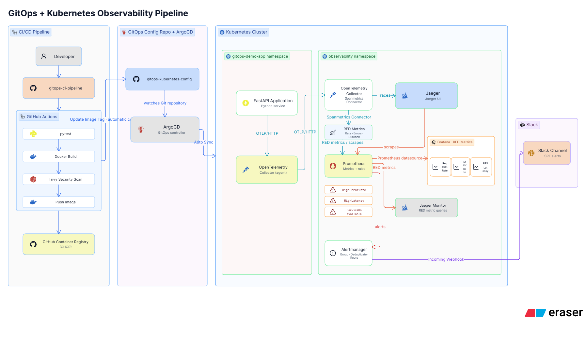
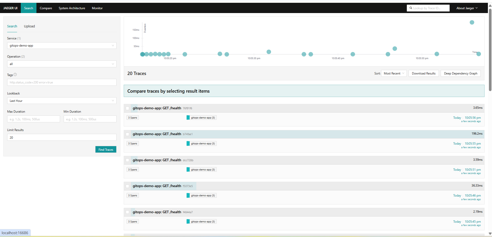
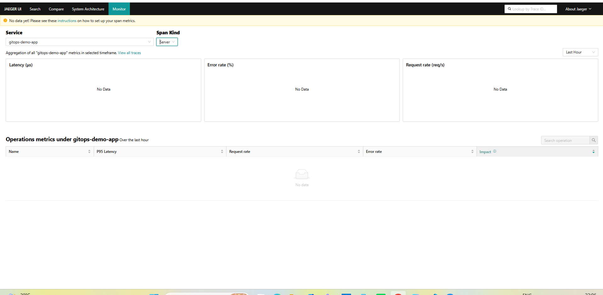
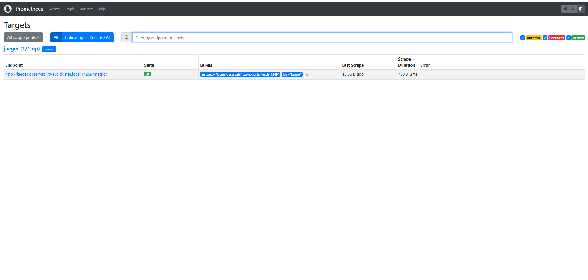

# GitOps CI/CD Pipeline — FastAPI, ArgoCD, and Kind Kubernetes

A FastAPI service that's tested, scanned, and published by GitHub Actions, then deployed and reconciled by ArgoCD onto a local Kind cluster — with rollback done entirely through Git.

---

## Quick Overview

I designed, built, and validated this GitOps pipeline end-to-end. It's split across two repositories on purpose: [`gitops-ci-pipeline`](https://github.com/aniket-devop/gitops-ci-pipeline) owns the application and CI, and [`gitops-kubernetes-config`](https://github.com/aniket-devop/gitops-kubernetes-config) (this repo) owns the desired cluster state that ArgoCD reconciles against.

**Stack:** FastAPI · pytest · Docker (non-root, `python:3.12-alpine`) · Trivy · GHCR · Helm · ArgoCD · Kind · OpenTelemetry · Jaeger · Prometheus.

This runs on a **local Kind cluster**, not a managed cloud environment. It's a hands-on demonstration of the GitOps pattern, and I'm not presenting it as production-ready — no production traffic, uptime, or scale claims are made anywhere below.

My role was building both repositories, wiring the CI pipeline, writing the Helm chart, configuring the ArgoCD `Application`, and validating the rollback and scaling behavior directly against the cluster.

**Why this project:** I wanted hands-on proof of the GitOps pattern rather than just being able to describe it — specifically the boundary between "CI builds and publishes" and "a separate reconciliation loop deploys," which is where a lot of push-based CD setups quietly cut corners by letting CI call `kubectl apply` directly.

---

## Architecture



Two halves, deliberately kept apart:

- **CI (build & publish)** — `gitops-ci-pipeline` tests, builds, scans, and pushes an image to GHCR.
- **CD (GitOps reconciliation)** — this repo holds the desired state; ArgoCD watches it and reconciles the cluster.

Separating them means the app team never needs cluster credentials, and the cluster's desired state is always fully described in Git, independent of any single CI run. GHCR is a passive artifact store here — it does not push to ArgoCD or to this repo; Kubernetes pulls from it during deployment, nothing more. The `gitops-demo` GHCR package is public, so no `imagePullSecrets` or registry credentials are required on the cluster side — only the CI push requires authentication.

**Why Kind:** a local Kind cluster gives a real, multi-node-capable Kubernetes API to reconcile against, without needing cloud credentials or spend just to validate the pipeline mechanics. It's a deliberate scope boundary, not a limitation I'm unaware of — moving to a managed cluster is a Future Improvement, not a blocker to what's already working here.

---

## CI Pipeline

On every push to `main` in `gitops-ci-pipeline`, `.github/workflows/ci.yml` runs:

1. Checkout, set up Python 3.12, install dependencies
2. Run `pytest` — a failing test blocks everything downstream
3. Derive the image tag from the short commit SHA, so every published image maps directly to a commit
4. Build the Docker image
5. Scan it with Trivy (`severity: CRITICAL`, `exit-code: "1"`) — a CRITICAL finding fails the job before the image reaches GHCR
6. Push the image to GHCR (only reached if the scan passes)
7. Clone this repo with a scoped token, update `environments/dev/values-dev.yaml` with the new tag, commit as `github-actions[bot]`, and push

Steps 1–6 never touch this repository, and step 7 never touches Kubernetes — it only commits a changed value file.

**Evidence:** the automated commits `aed4bb5`, `6d381aa`, `978b36d`, `b65229a` in this repo's history are all CI-generated tag bumps, and the current `dev` tag (`b65229a`) matches the latest commit SHA in `gitops-ci-pipeline`.

**Why GHCR:** it's already authenticated through the existing `GITHUB_TOKEN`, so there's no separate registry account or credential set to manage, and the image lives next to the repo that builds it. That's a practical fit for this project's scope — not a claim that GHCR is inherently better than Docker Hub or a cloud registry.

**Why Trivy, and why CRITICAL only:** it integrates as a single Action step and gives a hard pass/fail gate rather than an informational report. Gating on CRITICAL only (not HIGH/MEDIUM) was a deliberate choice to keep the pipeline from blocking on findings that don't represent an immediate risk, while still stopping anything severe from reaching GHCR.

---

## GitOps / CD Flow

**GitHub Actions does not deploy directly to Kubernetes.** It stops at committing an updated image tag to `gitops-kubernetes-config`. From there:

`gitops-kubernetes-config (Git) → ArgoCD (watches this repo) → Kind cluster → FastAPI Pods`

ArgoCD is the only component with cluster credentials. It runs with automated sync, `prune: true`, and `selfHeal: true` — so it syncs without manual approval, removes resources deleted from Git, and reverts any manual `kubectl` change made directly against the cluster back to what's in Git. Only the `dev` environment has an `Application` wired up.

**Evidence:**


Local ArgoCD instance running at `127.0.0.1:8080` — confirms this is an actual running installation, not just a config file.


`gitops-demo-dev` shown `Healthy` / `Synced`, reading `helm/gitops-demo` at `targetRevision: main`, deployed to namespace `gitops-demo-dev` (local ArgoCD UI).

---

## Observability

**Jaeger** (`jaegertracing/all-in-one`) runs in the `observability` namespace, receiving OTLP/HTTP traces from the app on port `4318`. It's managed by its own ArgoCD `Application` (`observability`), reading plain manifests from `observability/` in this repo — same automated `prune`/`selfHeal` policy as the app.

**Evidence:**



Traces for `gitops-demo-app` in Jaeger's Search view — each `GET /health` request showing 3 spans and sub-5ms duration.



A single trace's span waterfall — the parent `SERVER` span and its two ASGI child spans, with exact per-span duration.

**Prometheus** scrapes Jaeger's internal metrics endpoint (`14269`) every 15 seconds. Jaeger is configured with `METRICS_STORAGE_TYPE=prometheus` and `PROMETHEUS_SERVER_URL` pointing back at it, wiring up the data source for Jaeger's "Monitor" tab.



Prometheus's own Targets page showing the `jaeger` scrape target in state `UP` — confirmation that metrics are actually flowing, not just that the config was written.

**Why a separate namespace and `Application`:** keeping `observability` on its own ArgoCD `Application` means Jaeger and Prometheus reconcile independently of the app — a change to one doesn't trigger a sync of the other, and either can be deleted/recreated from Git without touching the application deployment.

**Not yet implemented:** the Monitor tab's RED-metrics dashboard (per-operation latency, error rate, request rate) additionally needs an OpenTelemetry Collector with a `spanmetrics` connector sitting between the app and Jaeger, to convert spans into metrics — Jaeger doesn't generate these itself. The trace pipeline (Search tab) and the Prometheus scrape connection are both confirmed working; the Collector is a scoped follow-up, not yet built.

## Repository Structure

| Repo | Contains | Role |
|---|---|---|
| `gitops-ci-pipeline` | FastAPI source, `Dockerfile`, `tests/`, `.github/workflows/ci.yml` | Owns app code and image build; never touches the cluster |
| `gitops-kubernetes-config` (this repo) | `argocd/application.yaml`, `helm/gitops-demo/` (chart + templates), `environments/dev`, `environments/staging` | Owns desired cluster state; watched by ArgoCD |

This repo's layout:

```
gitops-kubernetes-config/
├── argocd/application.yaml
├── environments/
│   ├── dev/values-dev.yaml
│   └── staging/values-staging.yaml
└── helm/gitops-demo/
    ├── Chart.yaml
    ├── values.yaml
    └── templates/{deployment.yaml, service.yaml}
```

---

## Helm Configuration

Chart `gitops-demo`, v0.2.0, appVersion `1.0.0`. Base `values.yaml` sets 3 replicas, a `ClusterIP` service (port 80 → container 8000), resource requests/limits, and liveness/readiness probes on `/health`.

| | Base | `dev` | `staging` |
|---|---|---|---|
| `replicaCount` | 3 | 1 | 2 |
| `image.tag` | `local` | `b65229a` (CI-managed) | `initial` (static, not CI-managed) |

Environment files only override `replicaCount` and `image` — probes and resources are inherited unchanged from the base chart. **Staging has an ArgoCD `Application`, but it's not automated** — there's no `prune`/`selfHeal`, so it requires a manual sync rather than deploying on its own.


**Health probes:** both liveness and readiness check `/health` on port 8000, but with different timing and different consequences on failure. Liveness (`initialDelaySeconds: 5`, `failureThreshold: 3`) restarts the container after repeated failures — it assumes the process is unrecoverable without a restart. Readiness (`initialDelaySeconds: 3`, `failureThreshold: 3`) instead pulls the Pod out of the Service's endpoint list without touching its lifecycle — it assumes the Pod may still recover on its own. I exercised both manually against a running Pod by breaking the `/health` route and watching the expected behavior in `kubectl get pods` (restart count increasing for liveness; `READY` dropping to `0/1` with no restart for readiness) — this is a manual observation, not something backed by a captured log or script in either repo.

---

## Security

What's actually implemented:

- **Trivy CRITICAL gate** — hard fail (`exit-code: "1"`) before an image can reach GHCR
- **Non-root container** — Dockerfile creates and switches to `appuser` before the app runs
- **No hardcoded credentials** — GHCR auth via `GITHUB_TOKEN`, cross-repo commits via a separately scoped `GITOPS_REPO_TOKEN`
- **Drift correction** — `selfHeal: true` reverts undocumented manual cluster changes

Not implemented: NetworkPolicy, RBAC, Pod security contexts beyond the non-root user, image signing. This is not an enterprise-hardened setup — the goal was to get the highest-value controls (a scanning gate and an unprivileged runtime user) right, not to cover every hardening dimension.

---

## GitOps Rollback

The strongest evidence in this project — rollback as a pure Git operation, no `kubectl rollout undo`, no ArgoCD CLI:

- `57e6a90` — CI-managed commit updating the dev image tag to `978b36d`
- `9f75968` — `git revert 57e6a90`, changing `environments/dev/values-dev.yaml` back from `tag: 978b36d` to `tag: 6d381aa`

Because automated sync is on, ArgoCD picked up the revert commit and reconciled the cluster back to the previous image tag with no manual intervention. The revert commit alone was sufficient — rollback and deployment go through the exact same mechanism.

This matters more than it might look at first glance: it means there's no separate "rollback tool" or runbook to maintain. Anyone who can `git revert` can safely roll back a deployment, and the action is permanently recorded in Git history rather than living only in a cluster's ephemeral state.

---

## Validation / Evidence

Backed by a screenshot, commit, or file in one of the two repos:

- ArgoCD `gitops-demo-dev` shown `Healthy` / `Synced` (screenshot)
- `kubectl scale deployment gitops-demo --replicas=5 -n gitops-demo-dev` — Pods observed `ContainerCreating` → `Running`, excess Pods `Terminating` (screenshot)
- Git revert `9f75968` reverting `57e6a90`, confirmed in this repo's commit history
- CI-generated tag-bump commits, current `dev` tag matching the app repo's latest commit

Reported but **not** independently backed by a file, log, or screenshot in either repo — noted here as observation, not verified fact: manually triggering a liveness/readiness probe failure by breaking `/health`, and a one-off `argocd-repo-server` slowdown under load on the local Kind cluster.

---

## Limitations

- Only `dev` is automated; `staging` has an `Application` but requires manual sync, and there's no promotion path from `dev`
- No Ingress/TLS — `ClusterIP` only, cluster-internal
- No Horizontal Pod Autoscaler; static replica counts
- No NetworkPolicy or RBAC manifests
- No monitoring/alerting wired in
- Local Kind cluster only — never run against a managed/cloud Kubernetes service
- No production traffic, uptime, or performance claims

## Future Improvements (Not Implemented)

- Promotion workflow to move a validated tag from `dev` to `staging`
- Managed cloud Kubernetes (e.g. AKS) and a cloud registry (e.g. ACR) — not started
- Ingress + TLS, Horizontal Pod Autoscaler
- NetworkPolicy + RBAC
- ArgoCD notifications on sync failure/degraded health
- OpenTelemetry Collector with a `spanmetrics` connector, to power Jaeger's Monitor (RED metrics) dashboard — distributed tracing (Jaeger) and metrics scraping (Prometheus) are already implemented and evidenced above; Grafana dashboards on top of Prometheus remain unbuilt

## Interview-Relevant Technical Decisions

- **Two repos, not one:** keeps cluster credentials out of the app team's hands and makes desired state fully auditable in Git.
- **GitOps over direct `kubectl apply`:** CI never touches the cluster; ArgoCD is the single point of deployment authority.
- **`selfHeal` + `prune`:** protects against undocumented manual drift and orphaned resources.
- **Git revert for rollback:** same reconciliation path handles both deploys and rollbacks — no separate rollback tooling needed.
